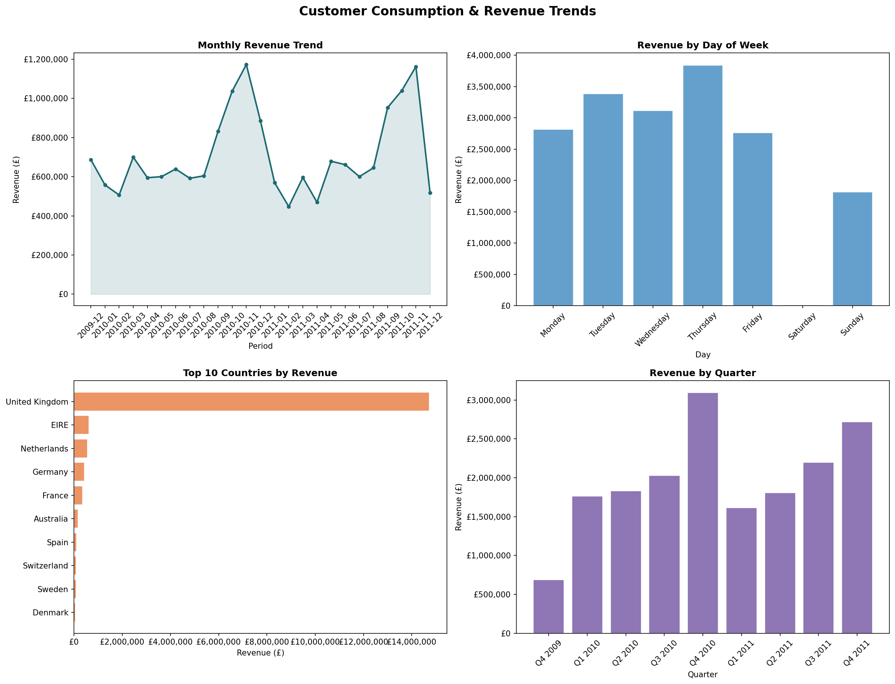
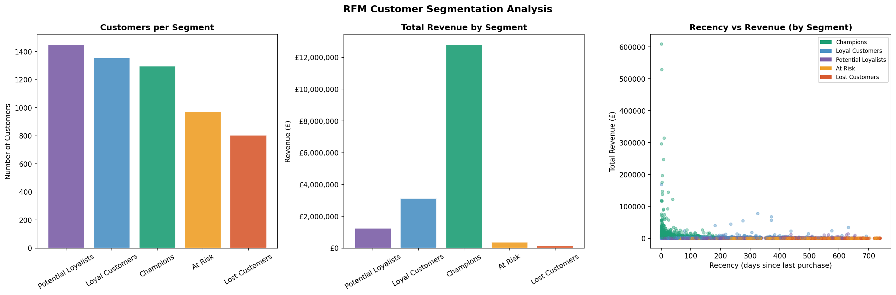
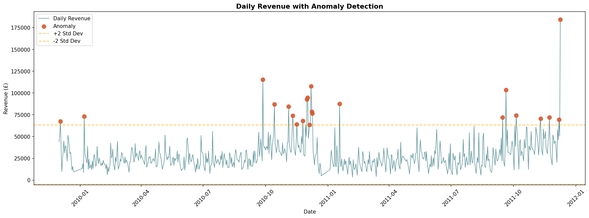

# Customer Consumption & Trend Analysis

A end-to-end data analysis project exploring customer behaviour, revenue trends, 
and consumption anomalies using a real-world retail dataset. Built using Python 
for analysis and segmentation, with outputs prepared for Power BI dashboarding.

---

## Project Overview

This project analyses transactional retail data to answer three core business questions:
- Which customer segments drive the most revenue?
- Where are the anomalies in daily consumption patterns?
- How does revenue trend across time, geography, and product categories?

The workflow covers data cleaning, exploratory analysis, RFM customer segmentation, 
anomaly detection, and KPI reporting — producing clean datasets ready for BI dashboarding.

---
## Interactive Power BI Dashboard

View the live interactive dashboard here:

🔗 **[Open Power BI Dashboard](https://app.powerbi.com/view?r=eyJrIjoiYzAyNGQ4NmMtNjNhOC00ZDUzLTg4NmUtNzZjMjI2ZmY5YTQ1IiwidCI6IjM5MjIwMTU5LTFhOGQtNDExMC1iOGI4LWMzODk1MjQzODlhYSJ9)**

The dashboard includes:
- KPI overview and revenue monitoring
- Customer consumption behaviour analysis
- RFM customer segmentation
- Revenue trend analysis
- Consumption anomaly detection
- Geographic sales insights
---

## Tools & Technologies

| Tool | Purpose |
|------|---------|
| Python (Pandas, NumPy) | Data cleaning, transformation, EDA |
| Matplotlib / Seaborn | Exploratory visualisations |
| Scikit-learn | Z-score anomaly detection |
| Power BI | Interactive dashboard (in progress) |
| Google Colab | Development environment |
| GitHub | Version control and portfolio hosting |

---

## Dataset

**Source:** UCI Machine Learning Repository — Online Retail II  
**Records:** 1M+ transactions across 2009–2011  
**Coverage:** UK-based online retailer with international customers  
**Link:** https://archive.ics.uci.edu/dataset/502/online+retail+ii

---

## Workflow

### 1. Data Cleaning
- Removed ~20% of records: missing Customer IDs, cancellations, zero-price and negative quantity rows
- Engineered date features: year, month, quarter, day of week, hour
- Created revenue column (Quantity × Price)
- Exported clean dataset for downstream use

### 2. KPI Summary

| KPI | Value |
|-----|-------|
| Total Revenue | £17,743,429 |
| Total Orders | 36,969 |
| Unique Customers | 5,878 |
| Unique Products | 4,631 |
| Avg Order Value | £479.95 |
| Avg Revenue per Customer | £3,018.62 

### 3. Revenue Trend Analysis
Analysed revenue across monthly, daily, quarterly, and geographic dimensions 
to identify seasonality patterns and key market concentrations.

### 4. RFM Customer Segmentation
Segmented customers using Recency, Frequency, and Monetary scoring — 
a standard CRM and marketing analytics technique for identifying 
high-value customers and churn risk.

| Segment | Description |
|---------|-------------|
| Champions | Bought recently, buy often, spend the most |
| Loyal Customers | Regular buyers with strong spend |
| Potential Loyalists | Recent customers with growing frequency |
| At Risk | Previously good customers going quiet |
| Lost Customers | Haven't purchased in a long time |

### 5. Anomaly Detection
Applied z-score methodology to flag days where revenue deviated 
significantly from the mean — useful for identifying campaign spikes, 
data quality issues, or unexpected demand shifts.

---

## Files in This Repository

| File | Description |
|------|-------------|
| `customer_analysis.py` | Full analysis script |
| `cleaned_retail_data.csv` | Cleaned transaction dataset |
| `rfm_segments.csv` | RFM scores and customer segments |
| `daily_revenue_anomalies.csv` | Daily revenue with anomaly flags |
| `revenue_trends.png` | Revenue trend visualisations |
| `rfm_segmentation.png` | RFM segment charts |
| `anomaly_detection.png` | Anomaly detection chart |

---

## Key Findings

- **High average revenue per customer (£3,018.62)** suggests a predominantly B2B customer 
  base — individual retail consumers rarely spend at this level, pointing to wholesale 
  buyers driving the bulk of revenue.

- **22 anomalous trading days detected** out of ~700 total — December 2011 recorded the 
  single highest revenue spike at £184,367 (z-score: 9.09), over 9 standard deviations 
  above the daily mean, strongly indicating a large seasonal wholesale order rather than 
  organic demand. Five of the top 10 anomalous days fall in Nov–Dec, confirming a 
  consistent Q4 demand pattern.

- **September and December consistently appear in the top anomaly dates across both years** 
  (Sep 2010, Sep 2011, Dec 2010, Dec 2011) — suggesting predictable seasonal demand cycles 
  that could be used to inform stock planning and resource allocation.

- **Average order value of £479.95** across 36,969 orders indicates high-value, 
  low-frequency purchasing behaviour — typical of gift and wholesale retail, 
  where fewer but larger basket sizes drive overall revenue.
---

## Author

**Deepika Dhanola**  
BI & Data Analyst | PL-300 & DP-900 Certified  
[LinkedIn](https://www.linkedin.com/in/deepika-dhanola/) · deepikadhanola27@gmail.com
